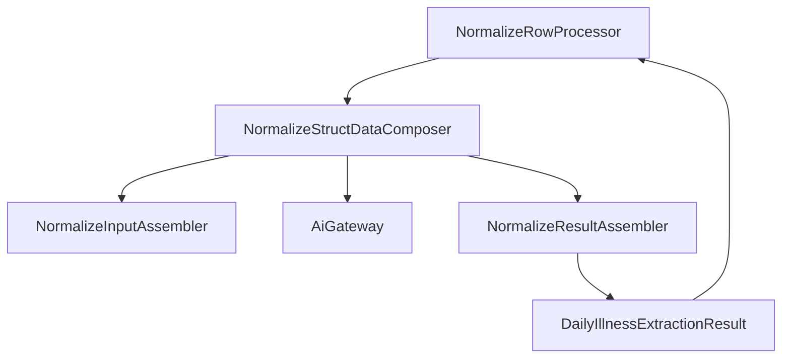
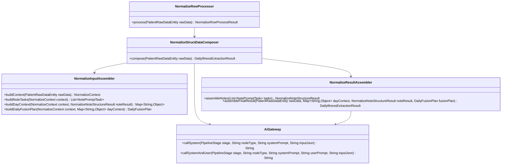

# Normalize 三层化重构草案

## 1. 文档目的

本文档用于梳理当前 normalize 链路的精简重构方案，目标是把现有“组装 + LLM 调用 + 校验 + 结果拼装”混在一起的调用链拆成清晰的三层结构。

适用范围：

- `pipeline.handler.NormalizeRowProcessor`
- `pipeline.handler.NormalizeStructDataComposer`
- `domain.normalize.assemble.NormalizeNoteStructAssembler`
- `domain.normalize.validation.NormalizeOutputValidator`

本草案只描述目标结构和方法签名，不直接改动当前数据库结构、主链路调度结构和 API 输出字段。

## 2. 当前链路的核心问题

当前 `NormalizeRowProcessor -> NormalizeStructDataComposer -> NormalizeNoteStructAssembler -> NormalizeOutputValidator -> NormalizeModelGateway` 存在以下问题：

1. `NormalizeStructDataComposer` 同时负责输入解析、note 结构化编排、daily fusion 编排、校验结果回填、最终 JSON 拼装，职责过厚。
2. `NormalizeNoteStructAssembler` 同时负责 note 输入组装、prompt 选择、LLM 调用、校验结果整理和输出排序，跨越了三层职责。
3. `NormalizeOutputValidator` 名称像“校验器”，实际同时做了模型调用、重试、结果校验，是当前最容易让人误判的类。
4. LLM 调用点不在业务主链上显式暴露，阅读 `compose` / `assemble` 方法时无法快速定位“哪里真正调用了模型”。
5. `daily_fusion` 节点依赖前序 note 节点的已校验结果，因此不能把整条链路粗暴理解成“单次三层调用”。
6. 当前项目里的 `NormalizeModelGateway / FormatModelGateway / WarningModelGateway` 在调用方式上高度重复，拆得过散。
7. 当前项目里的 `IllnessCourseTimeResolver / NoteTypePriorityResolver` 都是 note 元数据派生逻辑，拆成独立类收益不高。

## 3. 重构目标

目标不是把当前逻辑拆成很多小类，而是把职责压缩到最少的一组具体类里，同时保持三层边界清楚。

建议目标结构如下：

1. 编排层：保留 `NormalizeStructDataComposer`
2. 第一层：新增 `NormalizeInputAssembler`
3. 第二层：合并多个 gateway，统一成 `AiGateway`
4. 第三层：新增 `NormalizeResultAssembler`

这样整个 normalize 主链，核心只看 5 个类就够了：

- `NormalizeRowProcessor`
- `NormalizeStructDataComposer`
- `AiGateway`
- `NormalizeInputAssembler`
- `NormalizeResultAssembler`

额外约束：

- 不新增“单实现接口 + Default 实现”双层壳。
- 不再为 note/fusion 分别再拆一组 assembler。
- 多个 gateway 允许合并成一个具体类，不再保留多套场景化 gateway。
- 尽量复用既有 `DayFactsBuilder`、`FusionFactsBuilder`、`TimelineEntryBuilder`、`NormalizePromptCatalog`、`NormalizePromptOutputValidator`、`NormalizeRetryInstructionBuilder`。
- `struct_data_json` 和 `event_json` 的现有输出结构先保持兼容。

## 4. 总体结构图

虽然当前链路里有 note normalize 和 daily fusion 两个节点，但没有必要为两个节点各拆一套类。更精简的做法是：

- 第一层把“所有 LLM 输入准备”都收口到 `NormalizeInputAssembler`
- 第二层统一用 `AiGateway`
- 第三层把“所有校验、重试、结果拼装”都收口到 `NormalizeResultAssembler`

建议整体调用图如下：



从类职责角度看：

```text
NormalizeRowProcessor
  -> NormalizeStructDataComposer
     -> NormalizeInputAssembler
        -> NormalizePromptCatalog
     -> AiGateway
     -> NormalizeResultAssembler
        -> NormalizePromptCatalog
```

## 5. 类职责草案

### 5.1 顶层编排层

#### `pipeline.handler.NormalizeRowProcessor`

保留现状，继续负责：

- reset 派生数据
- 调用 workflow
- 写回 `struct_data_json` / `event_json`
- 错误包装

不再感知 note 节点和 fusion 节点的内部细节。

#### `pipeline.handler.NormalizeStructDataComposer`

建议保留这个类作为顶层编排器，不额外引入 `NormalizeStructWorkflow`。

职责：

- 调用第一层组装 note 输入
- 调用第三层拿到 note 结构化结果
- 调用第一层组装 day context 和 daily fusion 输入
- 调用第三层完成 daily fusion 校验与最终结果拼装
- 组装最终 `DailyIllnessExtractionResult`

不负责：

- 逐字段组装 prompt 输入
- LLM 调用细节
- 校验重试细节

### 5.2 第一层：LLM 输入组装层

#### `domain.normalize.assemble.NormalizeInputAssembler`

职责：

- 从 `PatientRawDataEntity` 选择 `filterDataJson / dataJson`
- 解析原始 JSON
- 读取 `pat_illnessCourse`
- 过滤空病程
- 解析 note 时间
- 计算 note 排序优先级
- 选择 note 对应 prompt
- 组装逐条 note 的 prompt 输入
- 基于原始 JSON 和已校验通过的 note 结构化结果
- 调用 `DayFactsBuilder`
- 产出 `day_context`
- 判断是否允许生成 `daily_fusion`
- 调用 `FusionFactsBuilder`
- 组装 `daily_fusion` 的输入 JSON

这一层只负责“给模型什么输入”，不做模型调用，也不做结果校验。

说明：

- `IllnessCourseTimeResolver`
- `NoteTypePriorityResolver`

这两个 resolver 可以直接并进本类，不必单独保留。

### 5.3 第二层：模型调用层

#### `ai.gateway.AiGateway`

建议把当前多套 gateway 合并成一个具体类，作为统一模型调用边界。

职责：

- 接收 `stage / nodeType / prompt / input`
- 调用 Spring AI `ChatModel`
- 返回归一化后的 JSON 字符串

说明：

- 这一层不做业务校验。
- 这一层不拼装 `struct_data_json`。
- 这一层只提供“调用模型得到原始结果”的能力。
- 这一层必须显式保留 `PipelineStage` 和 `nodeType` 参数，不能因为合并而丢掉监控维度。

### 5.4 第三层：校验与结果拼装层

#### `domain.normalize.validation.NormalizeResultAssembler`

职责：

- 对逐 note 的 prompt task 逐条执行
- 调用模型
- 校验输出并按需重试
- 生成 retry 指令
- 产出 `NormalizeNoteStructureResult`
- 执行 `daily_fusion` 模型调用
- 校验输出并按需重试
- 拼装 `struct_data_json`
- 拼装 `dailySummaryJson`

这一层统一承接“调用后的所有事情”，不再拆 note/fusion 两套结果类。

## 6. 建议保留与建议合并

### 6.1 建议保留

- `NormalizeRowProcessor`
- `NormalizeStructDataComposer`
- `NormalizePromptCatalog`
- `DayFactsBuilder`
- `FusionFactsBuilder`

### 6.2 建议合并

| 当前类 | 当前问题 | 建议去向 |
|---|---|---|
| `NormalizeStructDataComposer` | 当前过厚，但它本身就是主编排入口 | 保留为顶层编排器，不再替换成新 workflow 类 |
| `NormalizeNoteStructAssembler` | 输入组装和模型执行/校验耦合 | 合并进 `NormalizeInputAssembler`，只保留“组装输入”职责 |
| `NormalizeOutputValidator` / `NormalizePromptOutputValidator` / `NormalizeRetryInstructionBuilder` / `TimelineEntryBuilder` | 这几类在 normalize 链路里总是一起出现，分散后阅读成本高 | 统一并入 `NormalizeResultAssembler` |
| `NormalizeModelGateway` / `FormatModelGateway` / `WarningModelGateway` 及其 Spring AI 实现 | 调用骨架一致，只是 `stage / nodeType / prompt` 不同 | 统一合并成一个 `AiGateway` |
| `IllnessCourseTimeResolver` / `NoteTypePriorityResolver` | 都是 note 元数据派生规则，单独成类收益低 | 合并进 `NormalizeInputAssembler` |
| `NormalizeSourceContextBuilder` / `DayContextAssembler` / `DailyFusionInputAssembler` | 这几个类粒度过细，容易为了结构而结构 | 不单独新增，统一合并进 `NormalizeInputAssembler` |

### 6.3 不建议硬合并

| 当前类 | 不建议完全合并的原因 |
|---|---|
| `DayFactsBuilder` | 它的输入是原始 JSON，负责事实提炼，不是简单字段拼装 |
| `FusionFactsBuilder` | 它的输入是 `day_context`，负责构造 fusion 推理输入，和 `DayFactsBuilder` 不是同一阶段 |
| `ProblemCandidateBuilder` | 它处理的是 problem 候选提炼，包含较多结构化 note 解析细节 |
| `RiskCandidateBuilder` | 它处理的是 risk 候选提炼，和 problem 候选虽然相近，但规则并不相同 |
| `NotePreparationSupport` | 这是多个 facts builder 的公共底座，适合作为内部 helper，不适合与顶层输入编排硬糊成一个类 |

说明：

- 这几类可以不作为“核心类”暴露给主链阅读者。
- 但不建议把它们全部塞进 `NormalizeInputAssembler`，否则 `NormalizeInputAssembler` 会重新膨胀成一个大杂烩。

## 7. 类图草案



## 8. 方法签名草案

下面的方法签名以“能直接落地”为目标，优先保证职责单一，不追求抽象层数。

### 8.1 顶层编排

```java
package com.zzhy.yg_ai.pipeline.handler;

@Component
@RequiredArgsConstructor
public class NormalizeStructDataComposer {

    public DailyIllnessExtractionResult compose(PatientRawDataEntity rawData);
}
```

### 8.2 第一层：输入组装

```java
package com.zzhy.yg_ai.domain.normalize.assemble;

public record NormalizeContext(
        PatientRawDataEntity rawData,
        String rawInputJson,
        JsonNode rawRoot
) {
}
```

```java
package com.zzhy.yg_ai.domain.normalize.assemble;

@Component
@RequiredArgsConstructor
public class NormalizeInputAssembler {

    public NormalizeContext buildContext(PatientRawDataEntity rawData);

    public List<NotePromptTask> buildNoteTasks(NormalizeContext context);

    public Map<String, Object> buildDayContext(
            NormalizeContext context,
            NormalizeNoteStructureResult noteResult
    );

    public DailyFusionPlan buildDailyFusionPlan(
            NormalizeContext context,
            Map<String, Object> dayContext
    );
}
```

```java
package com.zzhy.yg_ai.domain.normalize.assemble;

public record NotePromptTask(
        String noteType,
        String noteTime,
        NormalizePromptDefinition promptDefinition,
        String inputJson
) {
}
```

```java
package com.zzhy.yg_ai.domain.normalize.assemble;

public record DailyFusionPlan(
        boolean enabled,
        String skipReason,
        NormalizePromptDefinition promptDefinition,
        String inputJson
) {
}
```

### 8.3 第二层：模型调用

这一层建议合并成一个具体类：

```java
package com.zzhy.yg_ai.ai.gateway;

@Component
@RequiredArgsConstructor
public class AiGateway {

    public String callSystem(
            PipelineStage stage,
            String nodeType,
            String systemPrompt,
            String inputJson
    );

    public String callSystemAndUser(
            PipelineStage stage,
            String nodeType,
            String systemPrompt,
            String userPrompt,
            String inputJson
    );
}
```

### 8.4 第三层：校验与结果拼装

```java
package com.zzhy.yg_ai.domain.normalize.validation;

@Component
@RequiredArgsConstructor
public class NormalizeResultAssembler {

    public NormalizeNoteStructureResult assembleNotes(
            AiGateway aiGateway,
            List<NotePromptTask> tasks
    );

    public DailyIllnessExtractionResult assembleFinalResult(
            AiGateway aiGateway,
            PatientRawDataEntity rawData,
            Map<String, Object> dayContext,
            NormalizeNoteStructureResult noteResult,
            DailyFusionPlan fusionPlan
    );

    private NormalizeValidatedResult validateWithRetry(
            NormalizePromptDefinition promptDefinition,
            String inputJson
    );
}
```

## 9. `NormalizeStructDataComposer.compose(...)` 的目标伪代码

```java
public DailyIllnessExtractionResult compose(PatientRawDataEntity rawData) {
    NormalizeContext context = normalizeInputAssembler.buildContext(rawData);
    if (context == null || !StringUtils.hasText(context.rawInputJson())) {
        return new DailyIllnessExtractionResult("{}", null);
    }

    List<NotePromptTask> noteTasks = normalizeInputAssembler.buildNoteTasks(context);
    NormalizeNoteStructureResult noteResult = normalizeResultAssembler.assembleNotes(
            aiGateway,
            noteTasks
    );

    Map<String, Object> dayContext = normalizeInputAssembler.buildDayContext(context, noteResult);
    DailyFusionPlan fusionPlan = normalizeInputAssembler.buildDailyFusionPlan(context, dayContext);

    return normalizeResultAssembler.assembleFinalResult(
            aiGateway,
            rawData,
            dayContext,
            noteResult,
            fusionPlan
    );
}
```

## 10. 重构落地顺序建议

建议按以下顺序施工，避免一次性大改把主链路打断：

1. 保留 `NormalizeStructDataComposer` 作为入口，不重命名。
2. 先新增 `NormalizeInputAssembler`，把 `resolveRawInputJson / parseToNode / note 输入组装 / dayContext 构造 / fusion 输入组装` 收进去。
3. 合并多个业务 gateway，落成一个 `AiGateway`，并把 `stage / nodeType` 显式入参化。
4. 再新增 `NormalizeResultAssembler`，把 note 校验重试、daily fusion 校验重试、最终 JSON 拼装收进去。
5. 删除 `NormalizeOutputValidator`，不再保留“名字叫 validator，实际上在调模型”的聚合类。
6. 最终让 `NormalizeStructDataComposer` 只保留串联逻辑。

## 11. 这一版草案的边界

本草案明确不处理以下内容：

- `patient_raw_data` 表结构变更
- timeline API 结构变更
- 最终审核 Agent
- warning 侧事件池和病例快照链路
- normalize 之外的 scheduler / facade / stage 结构

## 12. 预期收益

按本草案重构后，阅读者只需要看 3 个业务位置：

1. 看 `NormalizeInputAssembler`，知道“LLM 输入是怎么组的”。
2. 看 `AiGateway`，知道“模型是在哪里调的”。
3. 看 `NormalizeResultAssembler`，知道“输出是怎么校验、重试和拼业务结果的”。

这样 `NormalizeStructDataComposer` 只负责串联，核心类固定在 5 个，同时把能合并的 gateway / validator / resolver 合并掉，但不把所有 builder 粗暴揉成一个巨型类。
